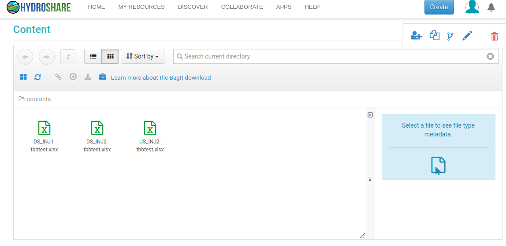
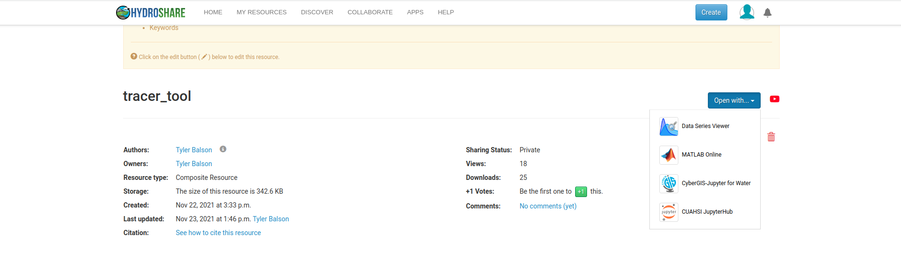
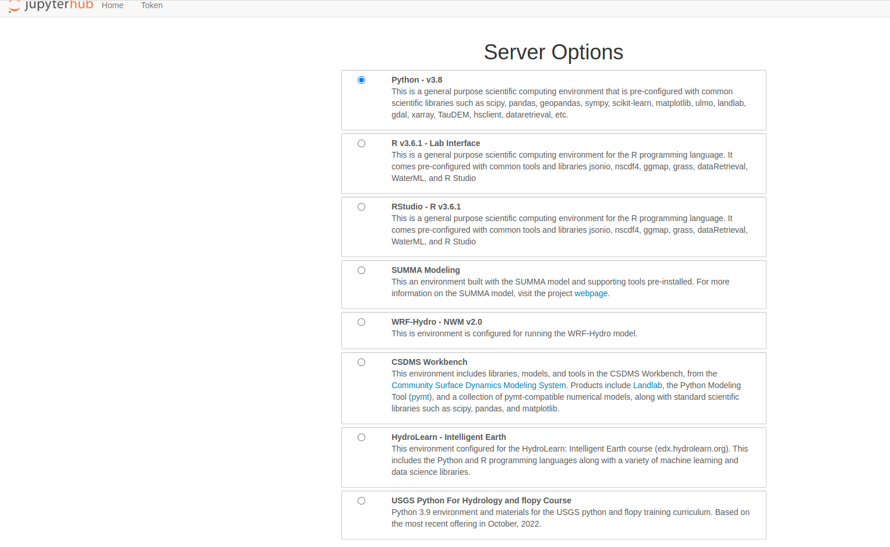
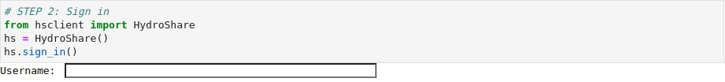
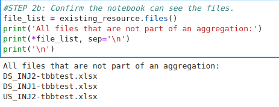
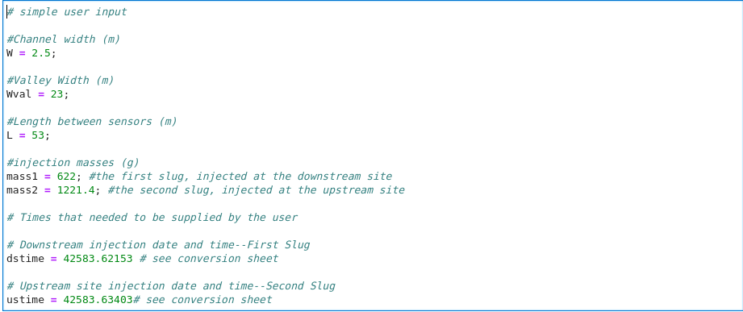
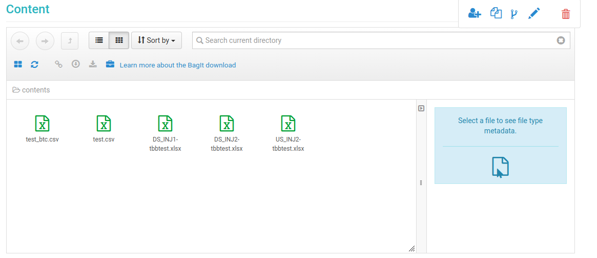

# Stream Tracer Tool README
Tyler Balson

email: tbalson@iu.edu

## Step 1: Create a Resource

Create a new resource on Hydorshare with your experimental data. Review the hydroshare documentation for an overview of resources and how to create one.

[Resources on HydroShare](https://help.hydroshare.org/creating-and-managing-resources/creating-resources/)

Once you have created the resource you will need the Resource ID from the link, here is an example link from a resource: [https://www.hydroshare.org/resource/f44e8baf1682456e9605221deef3a65b/](https://www.hydroshare.org/resource/f44e8baf1682456e9605221deef3a65b/)

The Resource ID is: f44e8baf1682456e9605221deef3a65b

There should be exactly three (3) files located within this resource two (2) downstream and one upstream data file (Fig. 1). 

We strongly recommend using the naming convention DS_INJ1, DS_INJ2 and US_INJ2, and that these files are in .csv format. As shown in this example .xlsx files work, however we suggest .csv. You can also use your own naming strategy if you prefer not to rename your files. You will enter the three (3) file names in the notebook in a subsequent step. Once you have your resource created and files correctly stored within you can start the analysis. 

## Step 2: Open the tool 
Go to the tracer tool resource page found [here](https://www.hydroshare.org/resource/6f3eee8ca110402ca432ebee52ab286f/).

Use the ‘Open with’ button to open the notebook using CUASHI JupyterHub (Fig 2).

Select the Python3.8 environment (Fig. 3). 

## Step 3: Populate the tool with user data and metadata 

Once the tool is launched you will need to populate the notebook with your Resource ID so the notebook can read in your experimental data. First enter your Resource ID in the notebook box labeled Step 1: Enter Resource ID (see Fig. 4).

.

You can confirm the notebook can access your files by executing the cell block labeled Step 2b, (see Fig. 6).

The user must fill out metadata associated with their experiment before proceeding. We require stream order, drainage area, date and the latitude and longitude of  the geographic location. We have provided a cell for the user to include any additional metadata they have available, in addition we have provided an example .csv file if the user would prefer to include a .csv. **If the user provides a .csv file it must be located in the same resource as the three input files and not in a sub-directory. In this case the output of Step 2b (Figure 6) will include a file named meta.csv. If you use a file it MUST be named meta.csv, and it must show up in the output from Step 2b. If you add your own metadata please follow the syntax outline within the notebook (Fig. 7). If a user has substantial metadata you are encouraged to contact the author at tbalson@iu.edu (message TRACER TOOL) in order to facilitate the incorporation.

The user is now ready to update the filename so that the names in (Fig. 6) are shown in (Fig. 8.). For example if your first filename is DS_INJ1.xlsx, on line 13 (Fig. 8) inside the single quotes should be:
ds1file = path + ‘**DS_INJ1.xlsx**’

If your downstream injection point 1 file is labeled something different (e.g., ds1.xlsx) then line 13 should read:

ds1file = path + ‘ds1.xlsx’

Lastly the user will need to enter experiment specific data including stream geometries, mass of tracer for Slug 1 and 2, and the date and time of each injection converted to serial datetime (Fig. 9).

A google sheet is available to convert a date time to a serial date time [here](https://docs.google.com/spreadsheets/d/1Fa4n4B5aSARWv9VAJo0BzUOWYQ8GaAYAgAvaZ1-IWPA/edit#gid=0).

## Step 4: Execute each cell and get results

You are now ready to proceed cell by cell. The execution of the final cell block will populate your Resouce ID with the results of your analysis in addition to populating our database. The population of our database is what gives users the contextual output in order to see where your experiment fits in with all other solute-tracer experiments stored within our database. Once you execute this step your experiment will be queued for incorporation to our database to support continued contextual output for future users. 

If you would like your results stored in a different location separate from the raw experimental data. For example a user may want a resource for experimental data and a resource for results. You will need to create two resources, and update the ‘storeit_USER’ variable with the Resource ID in the last cell block so it is not the same as the Resource ID with your experimental data (see, Fig. 9).

Assuming the same resource ID is used the results files will be stored alongside your three experimental files (see, Fig. 10).

  